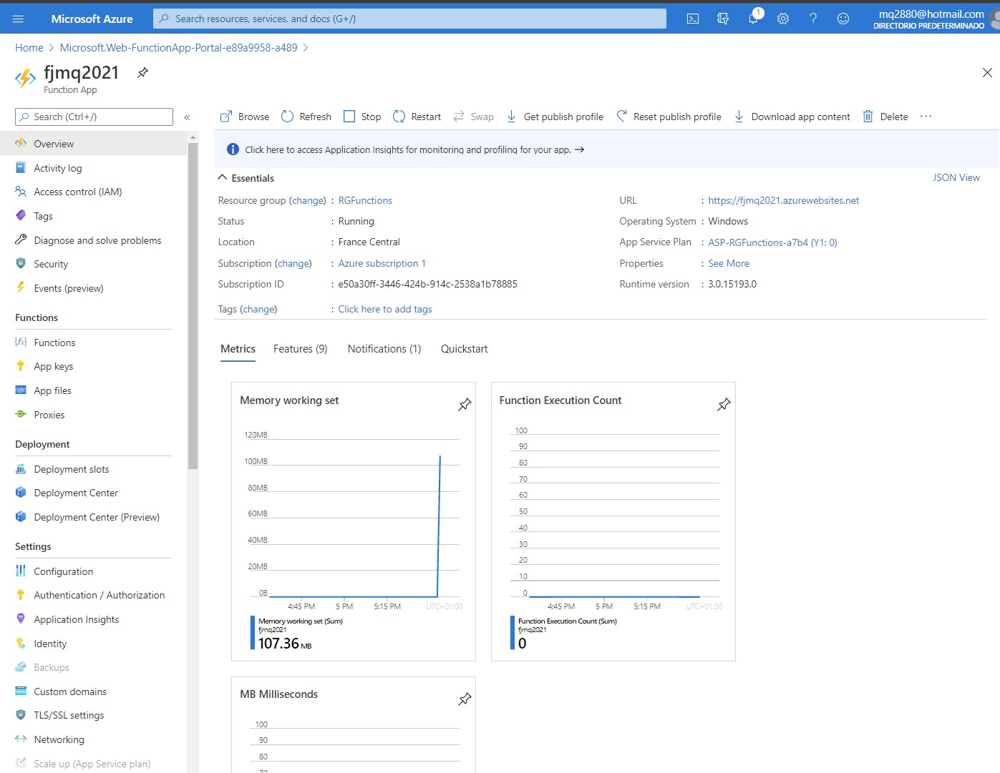
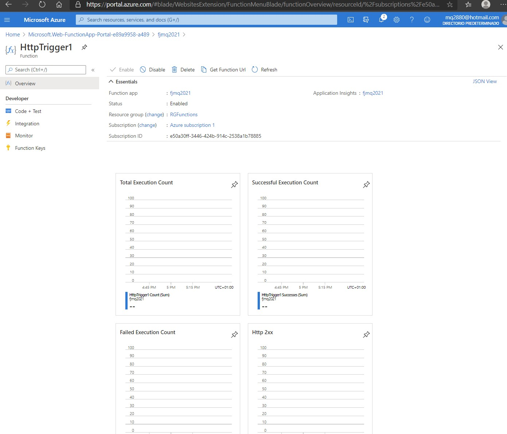
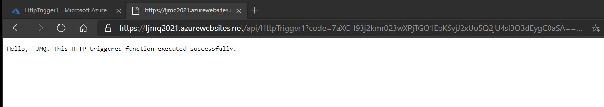

# Module 5: Hosting Services On-Premises and in Azure

# Lesson 2: Hosting Services in Web Apps Feature of Azure App Service

### Demonstration: Hosting ASP.NET Core Web APIs in Web Apps

- Abrimos el portal de azure
- Creamos un nuevo Function App 



- Creamos una nueva funcion 



- En al url de la funcion añadimos el parametro name con mis iniciales

  ```cs
      &name=FJMQ
  ```

```xml
 https://fjmq2021.azurewebsites.net/api/HttpTrigger1?code=7aXCH93j2kmr023wXPjTGO1EbKSvjJ2xUo5Q2jU4sl3O3dEygC0aSA==&name=FJMQ
```


- Comprobamos

  

